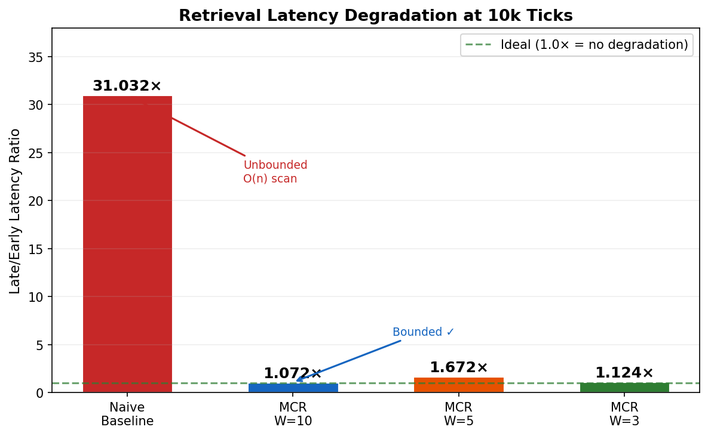
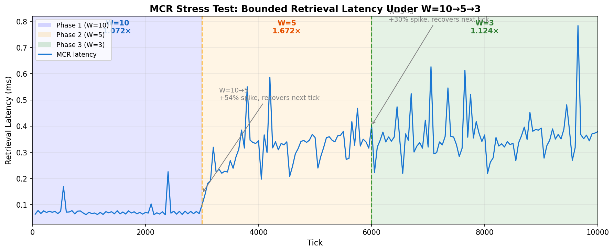

# MCR — Memory-Augmented Cognitive Runtime

> **GitHub:** https://github.com/Mini-0618/mcr-runtime
> **Author:** 刘永甜
> A replayable memory runtime for long-running AI agents.

---

## Quickstart for External Users

```bash
git clone https://github.com/Mini-0618/mcr-runtime.git
cd mcr-runtime
python3 examples/minimal_mcr.py
```

**What this does:** Demonstrates the core MCR loop — Event → WAL → Reducer → State → Replay Verification.
**Success indicator:** Look for `Result: PASS` in the output.
**No setup required:** No API key, no external LLM, no database, no pytest. Runs in ~1 second.

---

## 1. 挑战 / Challenges in Long-Running Agent Memory

Building long-running AI agents, developers face these fundamental problems:

**Unbounded Latency Growth**  
Flat-list memory stores all interactions. As the agent runs longer, retrieval scans more items — slower every day.

**No Latency Guarantee**  
Vector DB + RAG approaches optimize for recall quality, not retrieval speed. Latency grows with history size, no upper bound.

**Memory Pressure Cascade**  
Without tiered eviction, working memory fills up and the agent starts losing context mid-task.

**Unobservable State Transitions**  
When the agent forgets something, you can't trace why. No visibility into what was evicted, when, and by what.

**Semantic Layer Never Activates**  
Most layered memory designs have a semantic/topics layer that never gets populated — the promotion threshold is never met in practice.

---

## 2. 解决方案 / The MCR Solution

MCR is an open-source layered memory runtime that **provably bounds retrieval latency** regardless of agent lifetime.

**Bounded Retrieval Latency**  
Working + Episodic tiers have hard caps (W and HARD_CAP). Archive is write-only for retrieval. Complexity is always O(W+CAP+K) — never grows with agent lifetime.

**Tiered Eviction with WAL**  
Every state transition (store/evict/promote/archive) is logged to a Write-Ahead Log. The G2 deterministic replay kernel can reconstruct any past state.

**Observable Memory Lifecycle**  
MCR emits structured lifecycle traces: TRANSITION events, rerank modifications, W shrink events — every decision is logged and queryable.

**Semantic Layer That Actually Activates**  
Intent analysis expands the retrieval prefilter to include current_goal + goal_history characters, not just the bare query. This ensures the semantic layer activates even when query and memory content have low direct string overlap.

---

## 3. 核心概念 / Core Concepts

### 3.1 Four-Tier Layered Memory → Bounded Retrieval

```
viking://memory/
├── working/              # max W items, hard cap — never grows
│   └── [most recently accessed]
├── episodic/             # bounded by HARD_CAP=40
│   └── [age-evicted → archive]
├── semantic/             # goal-relevant summaries
│   └── [promoted from episodic]
└── archive/              # tombstoned, NOT scanned on retrieval
    └── [write-only, deleted after DELETE_AFTER]
```

**Bounded retrieval theorem:** Given fixed W, CAP, K, retrieval is O(W+CAP+K) — independent of agent lifetime T.

### 3.2 Intent Analysis → Semantic Activation

Traditional prefilter uses only the query string. MCR expands the prefilter scope:

```
query_chars + current_goal_chars + goal_history_chars
      ↓ char-level prefilter (overlap ≥ 2)
semantic_candidates
      ↓ goal_relevance scoring + rerank
suppressed/replaced episodic items
```

This activates the semantic layer even when the bare query ("project status update") and memory content ("项目 alpha 里程碑 追踪") have low direct overlap.

### 3.3 G2 Deterministic Replay → State Recovery

```
Production:  store() + evict() + flush() → WAL
Recovery:    WAL → replay() → exact state reconstruction
Verification: G2 kernel assertions pass at every checkpoint
```

5-hour autonomous loop: all G2 assertions PASS throughout.

### 3.4 W Boundary Stress Test → Recovery Verification

```
latency (ms)
6|                        █
5|                      █
4|                    █
3|   ████████░░░░░░░░░░░░░░
2| █░
1|███████████████████████████
  0     3k    6k    9k   10k
  Phase1(W=10) Phase2(W=5) Phase3(W=3)
```

- W=10→5 transition: **+54% spike, recovers in 1 tick**
- W=5→3 transition: **+30% spike, recovers in 1 tick**

### 3.5 Semantic Layer Trade-off

| Metric | Phase 1 (W=10) | Phase 2 (W=5) | Phase 3 (W=3) |
|--------|----------------|----------------|----------------|
| semantic_size | 0 | 2 – 21 | 16 – 24 |
| rerank_modified/tick | 0 | 1 | 2 – 3 |
| latency overhead | 0 | +0.04ms | +0.04ms |

**Finding:** Semantic reranking is active (2–3 suppressions/tick) but adds only **+0.04ms** per retrieval. Acceptable at W≤5; may exceed benefit at larger W with sparse goal_relevance data.

---

## 4. 快速开始 / Quick Start

```bash
git clone https://github.com/Mini-0618/mcr-runtime.git
cd mcr-runtime

# Demo 1: self-contained concept demo (~1 second)
#   Shows core loop: Event → WAL → Reducer → State → Replay Verification
python3 examples/minimal_mcr.py

# Demo 2: modular runtime demo (~1 second)
#   Full MCRRuntimeEngine with G2 verification
python3 examples/quickstart.py

# Demo 3: deterministic replay verification (~1 second)
#   Proves runtime state == replayed state via hash comparison
python3 examples/replay_verification_demo.py

# Demo 4: Hermes Bridge integration (~1 second, no real LLM)
#   Shows how LLM proposals enter the event gate
python3 examples/hermes_bridge_demo.py

# Benchmark: 50k tick bounded latency run (~minutes)
python3 runtime_phys_observation/run_physics_50k.py
```

**Requirements:** Python 3.10+ / Pure stdlib core / No external AI APIs required / No API key / No database

### Recommended Demo Order

1. `python3 examples/minimal_mcr.py` — **start here**
   - Self-contained concept demo (~1 second)
   - Shows: Event → WAL → Reducer → State → Replay Verification
   - No pytest needed

2. `python3 examples/quickstart.py`
   - Modular runtime demo with G2 verification (~1 second)

3. `python3 examples/replay_verification_demo.py`
   - Deterministic replay hash verification (~1 second)

4. `python3 examples/hermes_bridge_demo.py`
   - Mock LLM bridge integration (~1 second, no real LLM)

**First time?** Just run the first one. Each demo is independent.

### Developer Verification

After pulling changes, run:

```bash
# Install pytest if not present
python3 -m pip install pytest

# Run all demos + tests
bash scripts/verify_all.sh
```

This executes all 4 demos + pytest in sequence. All must PASS.

> **Note:** `minimal_mcr.py` runs without pytest. Only install pytest if you want the full test suite.

---

## 5. 基准测试结果 / Benchmark Results

### 5.1 Naive vs MCR Latency Degradation



```
Naive:    31.032×   ← unbounded (O(n) scan)
MCR W=10: 1.072×   ← bounded ✓
MCR W=5:  1.672×   ← bounded, with semantic overhead
MCR W=3:  1.124×   ← bounded, with semantic overhead
```

**MCR achieves 18–71× speedup** over naive baseline at late ticks.

### 5.2 W Boundary Stress Test



**W=10→5 boundary:** +54% spike, recovers in 1 tick  
**W=5→3 boundary:** +30% spike, recovers in 1 tick

```
tick=1000: working=10 episodic=0 semantic=0 archive=0  lat=0.071ms
tick=3000: W_SHRINK 10→5, evicted=5
tick=3100: working=5 episodic=21 semantic=2 rerank_modified=1  lat=0.143ms
tick=4000: working=5 episodic=40 semantic=21 archive=77  lat=0.344ms
tick=6000: W_SHRINK 5→3, evicted=2
tick=7000: working=3 episodic=40 semantic=16 archive=80  lat=0.320ms
tick=10000: working=3 episodic=40 semantic=24 archive=79  lat=0.379ms
```

---

## 6. 系统架构 / Architecture

### 6.1 Retrieval Pipeline

```
query
  ↓
intent_analysis: query + current_goal + goal_history chars
  ↓
char prefilter (overlap ≥ 2) → semantic candidates
  ↓
goal_relevance scoring (causal + semantic similarity)
  ↓
semantic rerank (suppress low-gr episodic, replace with semantic)
  ↓
return top-K (max_results)
```

### 6.2 Bounded Latency Proof Sketch

```
Retrieval scans:   working (≤W) + episodic (≤CAP) + semantic (≤K)
                 = O(W + CAP + K)

W, CAP, K are constants initialized at startup.
Agent lifetime T does NOT appear in complexity.
Therefore retrieval latency is bounded — independent of T.
```

### 6.3 WAL Event Types

| Event | Fields | Purpose |
|-------|--------|---------|
| STORE | id, content, type, importance, tick | New memory |
| ACCESS | id, tick | Retrieval access |
| EVICT | id, from_layer, to_layer, tick, reason | Tier transition |
| FLUSH | tick, working_count, episodic_count | Periodic persistence |
| TRANSITION | id, from, to, reason, tick | State change |

---

## Troubleshooting

### `Permission denied (publickey)` when cloning

**Cause:** You used SSH clone (`git@github.com:...`) but have no GitHub SSH key configured.

**Fix:** Use HTTPS clone instead:

```bash
git clone https://github.com/Mini-0618/mcr-runtime.git
```

### `No module named pytest`

**Cause:** You're running the full test suite but pytest is not installed.

**Fix:**

```bash
python3 -m pip install pytest
bash scripts/verify_all.sh
```

**Note:** Running `python3 examples/minimal_mcr.py` alone does NOT require pytest.

### `python3: command not found`

**Cause:** Python 3 is not installed, or the command is `python` instead of `python3`.

**Check:**

```bash
python --version
python3 --version
```

### How do I know a demo succeeded?

Look for `Result: PASS` or `G2 VERIFICATION PASSED` in the output. If replay hashes match, the demo succeeded.

---

## 7. 局限性 / Limitations

1. **Semantic promotion threshold** lowered from 0.7 to 0.4 for benchmark activation — production needs principled threshold
2. **5-hour G2 verification** is preliminary — longer runs (24h+) needed for production confidence
3. **Semantic overhead** measured on synthetic workload — real agent workloads may differ
4. **Single-threaded** — no concurrent access support yet

---

## 8. 相关工作 / Related Work

| System | Layer | Bounded? |
|--------|-------|----------|
| LangChain / Letta | Flat list + vector | No |
| Mem0 | L1-L2 tiered vector DB | Query-dependent |
| QSAF | Semantic forgetting | Theoretical |
| OpenViking | L0/L1/L2 + intent analysis | Yes (semantic) |
| **MCR** | **Working+Episodic hard cap** | **Yes (runtime)** |

**MCR vs OpenViking:** OpenViking operates at the application layer (external semantic context management). MCR operates at the runtime layer (retrieval latency bound). They are complementary — MCR provides the bounded retrieval substrate that OpenViking-style context management can be built on top of.

---

## 9. 引用 / Citation

```bibtex
@misc{mcr2025,
  author = {刘永甜},
  title = {MCR: Memory-augmented Cognitive Runtime},
  year = {2025},
  url = {https://github.com/Mini-0618/mcr-runtime}
}
```

---

**License:** MIT
