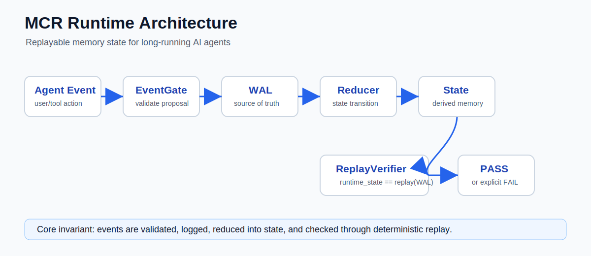
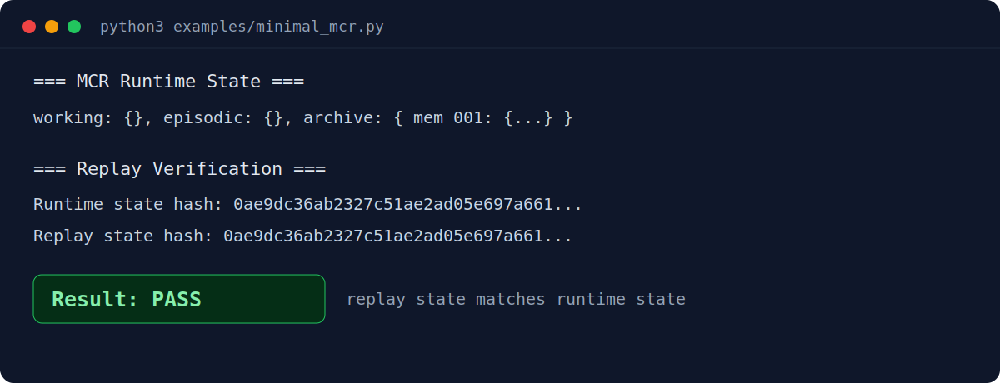

# MCR - Memory-Augmented Cognitive Runtime

A replayable memory runtime for long-running AI agents.




> Current release: **v0.9.3**
> Status: **Research runtime artifact / demo-ready / regression-protected**
> Repository: <https://github.com/Mini-0618/mcr-runtime>

MCR is a small event-sourced runtime kernel for studying how long-running AI agents can keep memory state observable, replayable, and recoverable. It does not train models and it does not try to be a complete agent framework. Its focus is narrower: make agent memory state changes explicit, logged, replayable, and testable.

## 30-Second Overview

If you only read one section, read this:

| Question | Answer |
| --- | --- |
| What is this? | A replayable memory runtime for long-running AI agents. |
| What does it prove? | Agent memory state can be represented as events and verified through replay. |
| What is the core invariant? | `runtime_state == replay(WAL)` |
| Does it need an LLM? | No. Demos run without an external LLM or API key. |
| Is it production-ready? | No. It is a research runtime artifact. |
| Where should I start? | Run `python3 examples/minimal_mcr.py`. |

## Why This Repository Exists

Most agent demos focus on task completion. MCR focuses on the runtime question behind long-running agents: can the system explain, recover, and verify its own memory state after many transitions?

The repository is organized to make that question inspectable:

- demos show the minimal flow
- runtime files show the kernel boundaries
- tests protect replay and validation behavior
- docs explain what is implemented and what is intentionally out of scope

## The Problem

Long-running agents do not only need better prompts. They need a runtime discipline for memory state.

Common failure modes include:

- memory explosion as history grows
- retrieval drift as older context competes with newer state
- state unrecoverability after a crash or bad transition
- memory lifecycle changes that cannot be audited
- direct LLM/tool mutation of state without a replay trail
- demos that look correct once but cannot prove state reconstruction

MCR treats these as runtime problems. The runtime records accepted events, reduces them into state, and checks whether replay reconstructs the same state.

## The Core Idea

MCR uses event sourcing for agent memory state:

```text
Event -> EventGate -> WAL -> Reducer -> Runtime State -> ReplayVerifier -> PASS / FAIL
```

The design goal is simple:

```text
runtime_state == replay(WAL)
```

If replay produces the same state, the runtime has a verifiable state history. If replay fails, the system has an explicit integrity signal instead of an invisible state drift.

## Current Release

| Field | Value |
| --- | --- |
| Release | v0.9.5 |
| Status | Installable package prototype / library-ready |
| Language | Python |
| External services | None required for demos |
| API key required | No |
| Database required | No |
| Main verification | `bash scripts/verify_all.sh` |

## Quickstart for External Users

```bash
git clone https://github.com/Mini-0618/mcr-runtime.git
cd mcr-runtime
python3 examples/minimal_mcr.py
```

Expected success indicator:

```text
Result: PASS
```



The minimal demo is self-contained. It requires no API key, no external LLM, no database, and no pytest.

## Full Verification

```bash
python3 -m pip install pytest
bash scripts/verify_all.sh
```

The verification script runs the demos and the regression tests. pytest is only required for the full verification suite.

## Developer Installation

```bash
git clone https://github.com/Mini-0618/mcr-runtime.git
cd mcr-runtime
python3 -m pip install -e ".[dev]"
bash scripts/verify_all.sh
```

This is optional. For the minimal demo, no installation is required. For development and testing, editable install is recommended.

## Demo Matrix

| Demo | Purpose | External dependency |
| --- | --- | --- |
| `examples/minimal_mcr.py` | 200-line self-contained concept demo | None |
| `examples/library_usage.py` | Using MCR as a library | None |
| `examples/quickstart.py` | Modular runtime demo | None |
| `examples/replay_verification_demo.py` | Replay hash verification | None |
| `examples/hermes_bridge_demo.py` | Mock LLM bridge demo | None |

Recommended first command:

```bash
python3 examples/minimal_mcr.py
```

To use MCR as a library in your own project:

```bash
python3 examples/library_usage.py
```

## What Each Component Does

| Component | File | Role |
| --- | --- | --- |
| Event Gate | `runtime/event_gate.py` | Validates event proposals before state transition |
| WAL | `runtime/wal.py` | Stores accepted events as the source of truth |
| Reducer | `runtime/reducer.py` | Applies events to runtime state |
| State | `runtime/state.py` | Holds derived runtime state |
| Engine | `runtime/engine.py` | Coordinates event acceptance and reduction |
| Replay Verifier | `runtime/replay_verifier.py` | Replays WAL and compares reconstructed state |
| Hermes Bridge | `runtime/hermes_bridge.py` | Parses mock LLM output into proposals |

## Runtime Flow

```text
User / Agent Event
        |
        v
Event Gate
        |
        v
WAL
        |
        v
Reducer
        |
        v
Runtime State
        |
        v
Replay Verifier
        |
        v
PASS / FAIL
```

## Validation Snapshot

| Validation target | Evidence in repo | Expected result |
| --- | --- | --- |
| Minimal replay demo | `examples/minimal_mcr.py` | `Result: PASS` |
| Modular runtime demo | `examples/quickstart.py` | G2 verification passes |
| Replay hash demo | `examples/replay_verification_demo.py` | original state equals replayed state |
| Hermes bridge demo | `examples/hermes_bridge_demo.py` | mock proposals pass through EventGate and replay |
| Full verification | `scripts/verify_all.sh` | `=== ALL PASS ===` |

The project is intentionally easy to verify from a fresh clone. The fastest check is:

```bash
python3 examples/minimal_mcr.py
```

The stricter check is:

```bash
python3 -m pip install pytest
bash scripts/verify_all.sh
```

## What Has Been Verified

The current repository includes regression coverage for:

- G2 replay determinism
- runtime state equality after WAL replay
- EventGate validation rules
- HermesBridge proposal parsing
- full bridge -> gate -> WAL -> reducer -> replay flow
- memory archive and purge behavior
- WAL replay hash integrity checks
- token leak regression checks

The full verification path is:

```bash
bash scripts/verify_all.sh
```

Expected result:

```text
=== ALL PASS ===
```

## What MCR Is

MCR is:

- a replayable memory runtime
- an event-sourced agent memory substrate
- a deterministic replay experiment for long-running agent state
- a research artifact for runtime verification and observability
- a small codebase for studying state recovery and memory lifecycle tracking

## What MCR Is Not

MCR is not:

- AGI
- a production-ready agent framework
- a chatbot framework
- a model training system
- a hosted service
- a replacement for vector databases
- a claim that memory alone creates general intelligence

## Use Cases

MCR is useful for:

- studying replayable agent state
- testing memory lifecycle designs
- validating event-sourced runtime flows
- demonstrating WAL-based recovery
- teaching why deterministic replay matters for long-running agents
- building small experiments around LLM proposal validation

MCR is not currently recommended for production deployment.

## Repository Layout

```text
runtime/                 Core runtime kernel
  wal.py                 Write-ahead log
  state.py               Runtime state container
  reducer.py             Pure state transition logic
  engine.py              Runtime engine wrapper
  event_gate.py          Event validation layer
  hermes_bridge.py       Mock LLM proposal bridge
  replay_verifier.py     Replay verification

examples/                User-facing demos
docs/                    Project documentation
tests/                   Regression tests
scripts/verify_all.sh    Full demo + test verification
```

## Documentation

| Document | Purpose |
| --- | --- |
| `docs/PROJECT_OVERVIEW.md` | Full project overview |
| `docs/GETTING_STARTED.md` | First-time user guide |
| `docs/ARCHITECTURE.md` | Runtime architecture |
| `docs/DEMO_WALKTHROUGH.md` | Demo explanation |
| `docs/EXTERNAL_VALIDATION.md` | External feedback process |
| `docs/KNOWN_ISSUES.md` | Current limitations |
| `docs/ROADMAP.md` | Project roadmap |
| `docs/FAQ.md` | Common questions |
| `docs/PACKAGING.md` | Packaging and editable install guide |
| `CHANGELOG.md` | Version history |
| `docs/RELEASES.md` | Release notes |

## Design Principles

MCR follows a few strict engineering principles:

- Proposals are not state authority.
- State changes must be represented as events.
- Accepted events must be written to the WAL.
- Runtime state must be reconstructable by replay.
- Demos should run without external services.
- Documentation should state limitations clearly.
- The project should avoid AGI, self-evolution, or production-readiness claims.

## Known Limitations

- The project is a research artifact, not a production runtime.
- The Hermes bridge is a mock/demo integration layer, not a live LLM service.
- The demos are intentionally small and deterministic.
- The runtime is focused on replay verification, not full task planning.
- External validation is still early.

## Roadmap Snapshot

Near-term work:

- keep external onboarding simple
- keep all demos stable
- improve replay verification diagnostics
- document known limitations clearly
- expand external validation notes
- avoid speculative AGI or self-evolution claims

## GitHub About Suggestion

Description:

```text
Replayable memory runtime for long-running AI agents.
```

Suggested topics:

```text
ai-agent, memory, event-sourcing, wal, replay, runtime, observability, agent-memory, python
```
